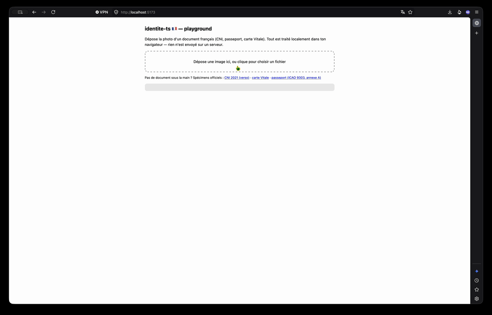

<div align="center">

# identite-ts 🇫🇷

**Une photo de CNI, passeport ou carte Vitale → un JSON typé. 100 % dans le navigateur.**

[](https://github.com/lau-sam/identite-ts/actions/workflows/ci.yml)
[](https://www.npmjs.com/package/identite-ts)
[](./LICENSE)



</div>

## 🚀 L'objectif

Remplir des formulaires d'identité (nom, prénoms, date de naissance…) est fastidieux et source d'erreurs. `identite-ts` résout ce problème : l'utilisateur photographie son document, votre application reçoit un objet JSON typé — sans qu'aucune donnée ne quitte son navigateur.

## ⚡ Essayer en 2 minutes

```bash
git clone https://github.com/lau-sam/identite-ts && cd identite-ts
npm install && cd playground && npm install && npm run dev
```

Pas de document sous la main ? Testez avec les **spécimens officiels** (documents fictifs publiés pour ce genre d'usage) :

| Document | Spécimen | Ce que l'outil extrait |
|---|---|---|
| CNI 2021 (verso) | [Wikimedia Commons — carte MARTIN Maëlys](https://commons.wikimedia.org/wiki/File:Carte_identit%C3%A9_%C3%A9lectronique_fran%C3%A7aise_(2021,_verso).png) | MRZ complète, checksums 100 % valides |
| Carte Vitale | [Wikipédia — Carte Vitale](https://fr.wikipedia.org/wiki/Carte_Vitale) | NIR + clé, sexe, naissance, département |
| Passeport | [ICAO Doc 9303 partie 4, annexe A](https://www.icao.int/publications/doc-series/doc-9303) (spécimen « Utopia ») | MRZ TD3, identité complète |

Vérifié sur ces spécimens : la CNI 2021 ressort avec **tous les checksums valides**, la carte Vitale avec **clé NIR validée** et lieu de naissance résolu.

- **100 % côté client** : aucune donnée ne quitte le navigateur (RGPD par construction).
- **Fondé sur les codes, pas seulement l'OCR** : MRZ (checksums ICAO 9303), NIR (clé 97), 2D-DOC ANTS — parsing déterministe et validable.
- **TypeScript first** : modèles typés, chaque champ porte sa provenance et la validité de son checksum.
- **Indépendant du framework** : une fonction asynchrone, zéro dépendance UI.
- **Léger par défaut** : les moteurs lourds (OCR ~2 Mo, Datamatrix ~1 Mo) sont chargés à la volée uniquement quand nécessaire ; les parseurs purs pèsent quelques Ko.

## Installation

```bash
npm install identite-ts
```

## Usage

### Tout-en-un : photo → JSON

```ts
import { extractDocument } from 'identite-ts';

const resultat = await extractDocument(fichierPhoto); // File, Blob, HTMLImageElement ou ImageData

if (resultat.document !== 'inconnu') {
  console.log(resultat.data?.nom?.valeur);           // 'MARTIN'
  console.log(resultat.data?.dateNaissance?.valeur); // '1990-07-13'
  console.log(resultat.document);                    // 'carte-identite' | 'passeport' | 'carte-vitale'
  console.log(resultat.paysEmetteur);                // 'FRA' — État émetteur, ≠ nationalité du titulaire
  console.log(resultat.confidence);                  // 0.95
  console.log(resultat.source);                      // 'mrz' | '2ddoc' | 'nir'
}
```

Pipeline de détection : **2D-DOC** (Datamatrix signé de la CNI 2021) → **MRZ** (2×36, 3×30, 2×44) → **NIR** (carte Vitale). Un document illisible ne jette jamais : `document: 'inconnu'` avec la zone `raw` remplie pour diagnostic.

La forme 2×36 est ambiguë : elle est partagée par le TD2 de l'ICAO et par l'ancienne CNI française, dont les dispositions sont incompatibles. Les deux lectures sont tentées et celle dont les checksums tombent juste l'emporte.

### Parseurs purs (sans OCR, quelques Ko)

Utilisables aussi côté serveur (Node ≥ 20) :

```ts
import { parseMrz, parseNir, parse2ddoc } from 'identite-ts';

const mrz = parseMrz([
  'P<UTOERIKSSON<<ANNA<MARIA<<<<<<<<<<<<<<<<<<<',
  'L898902C36UTO7408122F1204159ZE184226B<<<<<10',
]);
mrz.identite.nom?.valeur;  // 'ERIKSSON'
mrz.valide;                // true — tous les checksums ICAO passent

const nir = parseNir('2 69 05 49 588 157 80');
nir.sexe;                  // 'F'
nir.naissance;             // { annee2: 69, anneeProbable: 1969, mois: 5 }
nir.lieuNaissance;         // { type: 'metropole', departement: '49', codeInsee: '49588' }
nir.cleValide;             // true
```

### Lieu de naissance en clair (référentiel INSEE)

```ts
import { resolveCommune } from 'identite-ts/insee'; // chunk séparé (~280 Ko gzip)

resolveCommune('75056'); // { codeInsee: '75056', nom: 'Paris', departement: '75' }
resolveCommune('49588'); // undefined — commune fusionnée, absente du millésime courant
```

`extractDocument` fait cette résolution automatiquement pour les cartes Vitale (désactivable avec `resoudreCommune: false`).

### Chaque champ connaît sa fiabilité

```ts
interface Champ<T> {
  valeur: T;
  source: 'mrz' | '2ddoc' | 'nir' | 'insee' | 'ocr';
  checksumValide?: boolean; // présent si la source porte un checksum
}
```

Votre formulaire peut ainsi pré-remplir en vert ce qui est validé par checksum et en orange ce qui vient d'un OCR brut.

## Données extraites par document

| Document | Source | Données |
|---|---|---|
| CNI française (ancienne) | MRZ 2×36 (IDFRA) | nom, prénoms, sexe, date de naissance, n° de carte |
| CNI française 2021 | 2D-DOC ou MRZ 3×30 | + nationalité, date d'expiration |
| Carte d'identité étrangère | MRZ 3×30 (TD1) | nom, prénoms, sexe, date de naissance, nationalité, n°, expiration |
| Titre de séjour, carte officielle | MRZ 2×36 (TD2) | nom, prénoms, sexe, date de naissance, nationalité, n°, expiration |
| Passeport | MRZ 2×44 (TD3) | nom, prénoms, sexe, date de naissance, nationalité, n°, expiration |
| Carte Vitale | NIR + OCR | sexe, année + mois de naissance, lieu de naissance (via INSEE) ; nom et prénoms lus en OCR (sans checksum) |

### Documents non français

Les formats **TD1**, **TD2** et **TD3** sont normalisés par l'[ICAO 9303](https://www.icao.int/publications/doc-series/doc-9303) : la lecture ne dépend d'aucune particularité nationale. Toute carte d'identité, tout titre de séjour et tout passeport conforme est donc lu, quel que soit l'État émetteur — documents suisses, allemands, italiens…

Le TD2 couvre notamment les **titres de séjour européens** : le [règlement (CE) 1030/2002](https://eur-lex.europa.eu/legal-content/FR/TXT/?uri=CELEX%3A32002R1030) impose une zone de lecture conforme aux normes de l'OACI, sans fixer le format — TD1 et TD2 sont l'un comme l'autre valides, et tous deux sont lus.

`extractDocument` et `parseMrz` distinguent deux informations trop souvent confondues :

```ts
mrz.paysEmetteur            // 'CHE' — État qui a délivré le document
mrz.identite.nationalite    // 'FRA' — nationalité du titulaire
mrz.codeDocument            // 'ID'  — code brut de la MRZ
mrz.categorie               // 'carte-identite' | 'passeport' | 'inconnu'
```

`categorie` ne se déduit que du **premier** caractère du code document (`P` passeport, `A`/`C`/`I` autre document officiel). Le second caractère n'a jamais été normalisé — l'ICAO ne l'uniformise qu'à partir de la 9ᵉ édition de la spécification — il est donc exposé brut dans `codeDocument` sans être interprété.

En revanche, le **2D-DOC** (dispositif ANTS) et le **NIR** sont des formats strictement français : eux ne s'appliquent qu'aux documents français.

## Limites connues

- **L'adresse n'existe dans aucun code optique.** Elle n'est présente que dans la puce NFC (hors périmètre) ou imprimée au dos de l'ancienne CNI (souvent périmée).
- Le NIR ne donne que l'année et le mois de naissance, jamais le jour ; le siècle est déduit (`anneeProbable`).
- La qualité de l'OCR dépend de la photo : privilégiez un cadrage net de la zone MRZ.
- Le référentiel INSEE embarqué couvre le millésime courant : une commune fusionnée référencée par un vieux NIR peut ne pas être résolue.
- Par défaut, tesseract.js et zxing-wasm téléchargent leurs assets (WASM, modèles de langue) depuis un CDN public au premier usage. Les données de l'utilisateur ne quittent jamais le navigateur, mais pour un déploiement air-gapped ou strictement auto-hébergé, servez ces assets vous-même via les options `ocr.langPath`/`ocr.workerPath`/`ocr.corePath` et `datamatrix.wasmBaseUrl`.

## Jeux de données publics

Les spécimens listés plus haut servent à essayer la bibliothèque à la main. Pour la **mesurer** — taux de lecture MRZ, précision de localisation, régressions — il faut des jeux annotés. Ceux-ci sont publics, et leur licence a été relue sur la source primaire (`license.txt` du dépôt officiel ou fiche Zenodo) :

| Jeu | Ce qu'il apporte ici | Licence |
|---|---|---|
| [DocXPand-25k](https://github.com/QuickSign/docxpand) ([arXiv:2407.20662](https://arxiv.org/abs/2407.20662)) | 24 994 images de documents fictifs incrustés sur fonds réels, MRZ TD1/TD2/TD3 et champs annotés — localisation, OCR, MRZ | CC BY-NC-SA 4.0 (**non commercial**) |
| MIDV-500 et MIDV-2020 (`ftp://smartengines.com/midv-500/`) | Documents filmés en conditions dégradées : reflets, flou, cadrage partiel — la matière du chantier localisation/rectification | CC BY-SA 2.5 |
| [MIDV-Holo](https://github.com/SmartEngines/midv-holo) | Originaux et attaques par présentation, hologrammes annotés — détection de fraude | CC BY-SA 2.5 |
| [DLC-2021](https://zenodo.org/records/6466770) | Recaptures d'écran, photocopies, documents sans lamination — document rejoué | CC BY-SA 2.5 |
| [SmartDoc 2015](https://zenodo.org/records/1230218) | Documents A4 filmés au smartphone : pas des pièces d'identité, mais la référence pour la localisation en vidéo | CC BY 4.0 |

**Aucun de ces jeux n'est redistribué ici, et aucun n'entrera dans ce dépôt ni dans le paquet npm.** Le projet est sous licence MIT, qui autorise l'usage commercial : y commiter des images sous CC BY-NC-SA ou CC BY-SA reviendrait à leur accorder des droits que leurs auteurs n'ont pas donnés. Les utiliser localement pour évaluer est en revanche sans difficulté. Deux pièges à connaître : le partage à l'identique se propage à tout jeu dérivé ou augmenté que l'on publierait, et la licence affichée sur une page arXiv couvre l'article, jamais les données.

## Feuille de route

- [ ] **Localisation et rectification du document** : détecter le quadrilatère de la carte dans la photo, corriger la perspective, normaliser au format ID-1. Lève la contrainte de cadrage décrite dans les limites ci-dessus.
- [ ] **Détection de fraude** : repérer un document rejoué (photo d'écran, photocopie, capture), altéré ou incohérent — à commencer par les indices vérifiables sans référentiel (cohérence MRZ ↔ zone visuelle, checksums, dates impossibles).
- [ ] Vérification cryptographique de la signature 2D-DOC (ECDSA, certificats ANTS — [spécifications officielles](https://ants.gouv.fr/nos-missions/les-solutions-numeriques/2d-doc))
- [ ] Lecture de la puce NFC (port de [cnie-python-tools](https://github.com/hufon/cnie-python-tools), WebNFC)
- [ ] OCR des zones visuelles complémentaires (lieu de naissance CNI/passeport)
- [ ] Référentiel INSEE historisé (communes fusionnées)

## Développement

```bash
npm install
npm test              # vitest
npm run build         # tsup → dist/
node scripts/build-insee.ts   # régénère le référentiel des communes

cd playground && npm install && npm run dev   # démo locale
```

## Licence et auteur

[MIT](./LICENSE). Développé par [Coderkaine](https://www.coderkaine.com).
